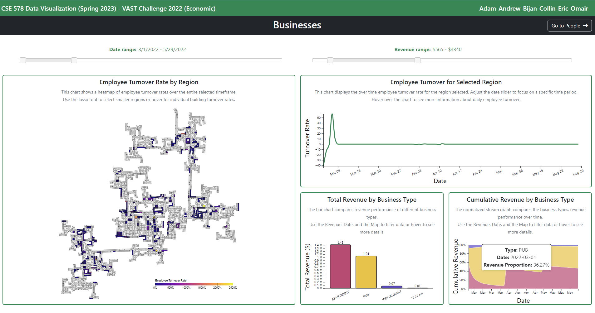
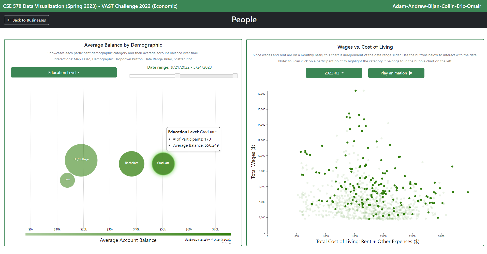

# CSE 578 Project - Adam-Andrew-Bijan-Collin-Eric-Omair

# Fiscal Clarity: Turning Data into Insights for Engagement, Ohio

## 2022 Economic VAST Mini-Challenge

### Contributors:
- **Omair Neazi**  
  Arizona State University, Tempe, Arizona, USA  
  [oneazi@asu.edu](mailto:oneazi@asu.edu)
  
- **Eric Waters**  
  Arizona State University, Tempe, Arizona, USA  
  [eswaters@asu.edu](mailto:eswaters@asu.edu)
  
- **Collin Wood**  
  Arizona State University, Tempe, Arizona, USA  
  [cjwood8@asu.edu](mailto:cjwood8@asu.edu)
  
- **Adam Miyauchi**  
  Arizona State University, Tempe, Arizona, USA  
  [amiyauch@asu.edu](mailto:amiyauch@asu.edu)
  
- **Bijan Anjavi**  
  Arizona State University, Tempe, Arizona, USA  
  [banjavi@asu.edu](mailto:banjavi@asu.edu)
  
- **Andrew Murwin**  
  Arizona State University, Tempe, Arizona, USA  
  [amurwin@asu.edu](mailto:amurwin@asu.edu)

## 1. Introduction

Big data has revolutionized the way businesses, governments, and societies around the globe operate. Data visualization, in particular, has emerged as a critical tool for exploring, analyzing, and communicating complex datasets. Visualizations transform tangled datasets into interactive visual representations capable of uncovering patterns, trends, and relationships contained within them. This paper presents our visualization interface solution for the 2022 VAST Economic Mini Challenge using the D3.js Javascript library. The main objective is to support city planners of Engagement, Ohio in identifying patterns and trends in the financial behaviors of its residents.

## 2. Visualization Design

The data visualization is split into two main pages:

### Business Page


The business page is composed of:
1. "Employee Turnover Rate by Region" - A heatmap.
2. "Employee Turnover for Selected Region" - A line chart.
3. "Total Revenue by Business Type" - A bar chart.
4. "Cumulative Revenue by Business Type" - A normalized stream graph.

### People Page


The people page showcases:
1. "Average Balance by Demographic" - An interactive bubble chart.
2. "Wages vs. Cost of Living" - A scatter plot.

Various interactions, such as hover tooltips, date and revenue range sliders, demographic attribute dropdowns, on-click events, a lasso tool, and animations are implemented across the visualization for an enhanced user experience.

## Full Paper

For a comprehensive breakdown of the design considerations, data preprocessing, use cases, and findings, please refer to the full paper.

## How to Run 
After cloning the repository, start the webpage by using the LiveServer VSCode extension or run:

```
npm i
node server.js
```

All data and files needed to run the project are included in the repository.